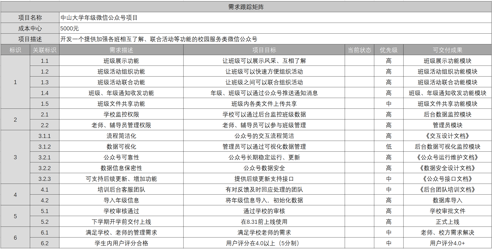

# Homework5

## 1. 你联合同学做一个年级微信公众号加强各班相互了解、联合活动 等。请写一份两页的报告，描述收集需求的方法，并附上收集的 需求跟踪矩阵（不少于五个需求）；

### 收集需求的方法

- 数据收集

  - 头脑风暴

    采用头脑风暴，开放性的联想公众号产品所需的需求，在讨论中集思广益完善各个部分

  - 问卷调查

    对于一些面向用户群体的需求，通过设计问卷的方式，向用户群体调查需求

  - 标杆对照

    参考现存的各类比较成熟的学生服务类公众号，进行类比，取其精华去其糟粕。

- 决策

  - 投票法

    这是几个同学一起做的公众号，当决策出现分歧的时候，采用投票的方式进行决策，然后可视后续情况进行更改优化

- 需求呈现

  - 思维导图

    在团队开会时，使用思维导图将需求分层、分级。

- 软件项目

  - 敏捷方法

    采用敏捷方法，用故事板画出用户的使用情节

### 收集到的需求

1. 业务需求
   1. 班级展示功能
   2. 班级活动组织功能
   3. 班级活动联合功能
   4. 班级、年级通知收发功能
   5. 班级文件共享功能
2. 相关方需求
   1. 学校监控权限
   2. 老师、辅导员管理权限
3. 解决方案需求
   1. 功能需求
      1. 流程简洁化
      2. 数据可视化
   2. 非功能需求
      1. 公众号可靠性
      2. 数据信息保密性
      3. 可支持后续更新、增加功能
4. 过度和就绪需求
   1. 培训后台客服团队
   2. 导入年级信息
5. 项目需求
   1. 学校审核通过
   2. 下学期开学前交付上线
6. 质量需求
   1. 满足学校、老师的管理需求
   2. 学生内用户评分合格

## 2. 使用思维导图，为作业1或2构建WBS ，并使用项目管理工具制作 WBS或根特图。并按要求检查工作包的可管理性，分解完整性。 例如：检查测试、培训等

### 思维导图

### WBS

### 检查工作包