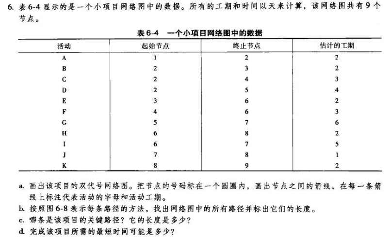
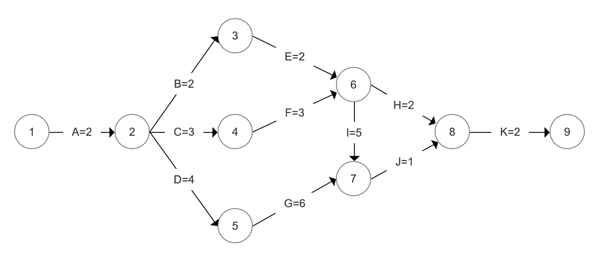
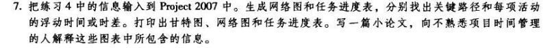
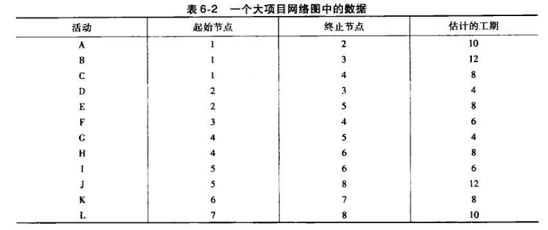
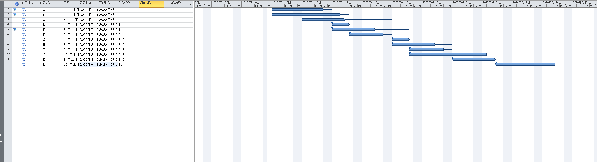
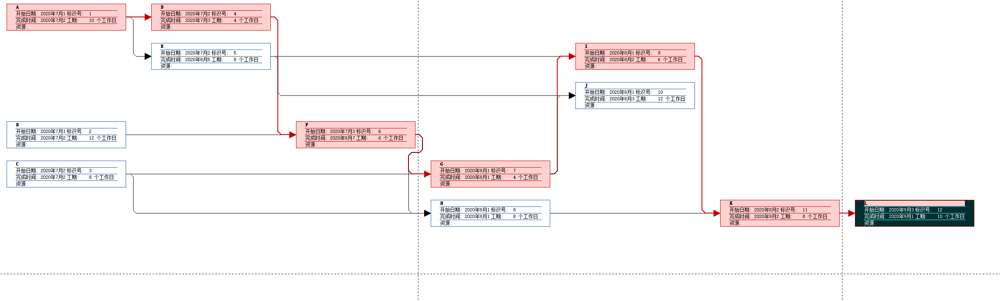
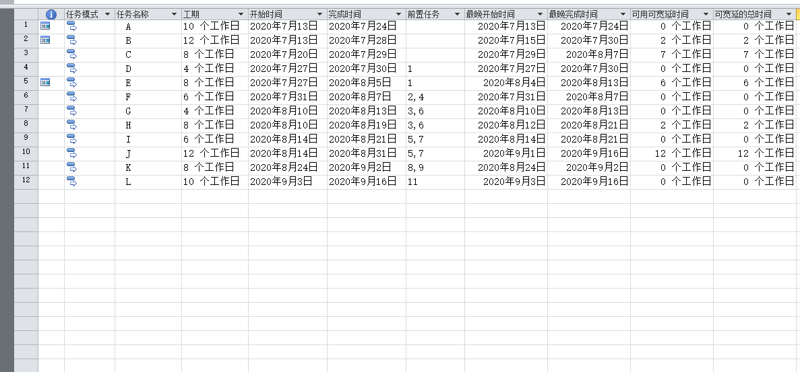

# Homework5

## 1. 教材练习题6

### a

### b

| 路径编号 |    路径     | 长度 |
| :------: | :---------: | :--: |
|    1     |  A-B-E-H-K  |  10  |
|    2     | A-B-E-I-J-K |  14  |
|    3     |  A-C-F-H-K  |  12  |
|    4     | A-C-F-I-J-K |  16  |
|    5     |  A-D-G-J-K  |  15  |

### c

关键路径为 A-C-F-I-J-K 长度为16

### d

16天

## 2. 教材练习题7

### 甘特图

### 网络图

关键路径A-D-F-G-I-K-L 48天

### 任务进度表-浮动时间

### 介绍

#### 任务进度表

任务进度表是由任务名称、开始时间、完成时间、最晚开始时间、最晚完成时间、可用可宽延时间和可宽延的总时间组成的表格，用于记录各项子任务的进度。其中宽延时间指的最晚开始时间-最早开始时间，代表着一个项目的浮动时间。

#### 甘特图

甘特图又称横条图，通过条状图在时间轴上显示各项目的进度以及联系。

#### 网络图

网络图是用流程图来显示任务之间的联系，一个框代表一个任务，一个连线代表任务的相关，箭头指向的节点前置任务为箭头开始的节点。

## 3. 收集网上资料，总结看板在软件项目中的使用

### 看板介绍

看板管理，常作“Kanban管理”（来自日语“看板”，カンバン，日语罗马拼写：Kanban），是丰田生产模式中的重要概念，指为了达到及时生产（JIT）方式控制现场生产流程的工具。及时生产方式中的拉式（Pull）生产系统可以使信息的流程缩短，并配合定量、固定装货容器等方式，而使生产过程中的物料流动顺畅。

> 以上出自百度百科(http://baike.baidu.com/view/660386.htm)

### 看板的载体分类

#### 实体白板/黑板

它的优点一目了然，方便工作成员展示自己的任务和进度，另一方面则可以提高成员间互相竞争的意识（谁干的多，谁解决的问题越难，成就感就越强）。当然，缺点也很明显，就是没有历史记录。虽然可以使用不定期的拍照来解决，但是还是不方便追溯。

白板适用在项目管理中所包含的元素有：
* 白板
* 列表(纵向列表、横向泳道)
* 便签纸
* 图钉、磁铁

#### 互联网式的看板

互联网式的看板则是软件化的工具，解决了历史记录的问题，方便追溯，如：
* Trello
* WeKan
* leangoo

### 看板在互联网产业的价值

> 参考自知乎

#### 实施过程中关注核心

Kanban方法在实施的过程中更多关注的是可视化的价值流动，从几个维度解释下：

1. 拉动式生产，下游工作完成后，主动拉动上游的任务移动
2. 限制WIP（work in progress），明确设定限制每个状态下，同一时间内有多少工作量，减少同一状态同一时间内，任务和价值的堆积。
3. 可视化的价值流动通常是端到端的流动，直观的反映用户的价值（通常是可交付的用户需求），并且反映出在价值流动过程中的瓶颈和问题，不断为团队改善提供依据。

#### 限制WIP数量的方式

Kanban方法限制直接，同一状态同一时间内的工作任务有最大限制。

#### 对任务变更管理

在Kanban方法的中，下游任务完成后，即可拉动上游任务下移，同时，只要生产力允许，即可新增需求。

#### 改进依据

Kanban方法是使用生产周期作为计划和过程改进的依据。