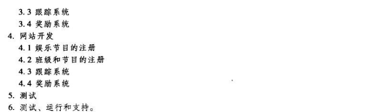

# Homework7

## 1. 作业1

|       **WBS条目**       | **数量或小时数** | **单位小时成本（美元）** | **子层总和（美元）** | WBS第二层总和（美元） | **占总和的％** |
| :---------------------: | :--------------: | :----------------------: | :------------------: | :-------------------: | :------------: |
|     1. **项目管理**     |                  |                          |                      |         39000         |      19.5      |
|        项目经理         |       150        |           100            |        15000         |                       |                |
|      项目其他成员       |       400        |            60            |        24000         |                       |                |
|     2. **需求定义**     |                  |                          |                      |         10000         |       5        |
|     3. **网站设计**     |                  |                          |                      |         40000         |       20       |
|     娱乐节目的注册      |       200        |            50            |        10000         |                       |                |
|    班级和节目的注册     |       200        |            50            |        10000         |                       |                |
|        跟踪系统         |       200        |            50            |        10000         |                       |                |
|        奖励系统         |       200        |            50            |        10000         |                       |                |
|     4. **网站开发**     |                  |                          |                      |         80000         |       40       |
|     娱乐节目的注册      |       250        |            80            |        20000         |                       |                |
|    班级和节目的注册     |       250        |            80            |        20000         |                       |                |
|        跟踪系统         |       250        |            80            |        20000         |                       |                |
|        奖励系统         |       250        |            80            |        20000         |                       |                |
|       5. **测试**       |                  |                          |                      |         15000         |      7.5       |
| 6. **测试、运行和支持** |                  |                          |                      |         16000         |       8        |
|   **总项目成本估计**    |                  |                          |                      |        200000         |                |

## 2. 作业2

|       **WBS条目**       |    1     |    2     |    3     |    4     |    5     |    6     |  总和  |
| :---------------------: | :------: | :------: | :------: | :------: | :------: | :------: | :----: |
|     1. **项目管理**     |   6500   |   6500   |   6500   |   6500   |   6500   |   6500   | 39000  |
|        项目经理         |   2500   |   2500   |   2500   |   2500   |   2500   |   2500   | 15000  |
|      项目其他成员       |   4000   |   4000   |   4000   |   4000   |   4000   |   4000   | 24000  |
|     2. **需求定义**     | 1666.67  | 1666.67  | 1666.67  | 1666.67  | 1666.67  | 1666.67  | 10000  |
|     3. **网站设计**     | 6666.67  | 6666.67  | 6666.67  | 6666.67  | 6666.67  | 6666.67  | 40000  |
|     娱乐节目的注册      | 1666.67  | 1666.67  | 1666.67  | 1666.67  | 1666.67  | 1666.67  | 10000  |
|    班级和节目的注册     | 1666.67  | 1666.67  | 1666.67  | 1666.67  | 1666.67  | 1666.67  | 10000  |
|        跟踪系统         | 1666.67  | 1666.67  | 1666.67  | 1666.67  | 1666.67  | 1666.67  | 10000  |
|        奖励系统         | 1666.67  | 1666.67  | 1666.67  | 1666.67  | 1666.67  | 1666.67  | 10000  |
|     4. **网站开发**     | 13333.33 | 13333.33 | 13333.33 | 13333.33 | 13333.33 | 13333.33 | 80000  |
|     娱乐节目的注册      | 3333.33  | 3333.33  | 3333.33  | 3333.33  | 3333.33  | 3333.33  | 20000  |
|    班级和节目的注册     | 3333.33  | 3333.33  | 3333.33  | 3333.33  | 3333.33  | 3333.33  | 20000  |
|        跟踪系统         | 3333.33  | 3333.33  | 3333.33  | 3333.33  | 3333.33  | 3333.33  | 20000  |
|        奖励系统         | 3333.33  | 3333.33  | 3333.33  | 3333.33  | 3333.33  | 3333.33  | 20000  |
|       5. **测试**       |   2500   |   2500   |   2500   |   2500   |   2500   |   2500   | 15000  |
| 6. **测试、运行和支持** | 2666.67  | 2666.67  | 2666.67  | 2666.67  | 2666.67  | 2666.67  | 16000  |
|   **总项目成本估计**    | 33333.33 | 33333.33 | 33333.33 | 33333.33 | 33333.33 | 33333.33 | 200000 |

## 3. 作业3

### a

CV = EV - AC = 100 000 - 90 000 = 10 000（美元）

SV = EV - PV = 100 000 - 120 000 = -20 000（美元)

CPI = EV / AC = 100 000 / 90 000 = 111.11%

SPI = EV / PV = 100 000 / 120 000 = 83.33%

### b

SPI < 1，所以落后于进度

CPI > 1，所以在预算下

### c

EAC = BAC / CPI = 18 000（美元）

EAC < BAC，所以表现得好

### d

完成时间 = 计划时间 / SPI  = 7.2（月）