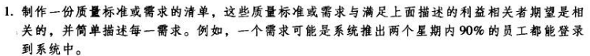
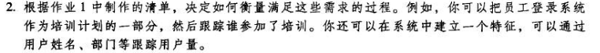
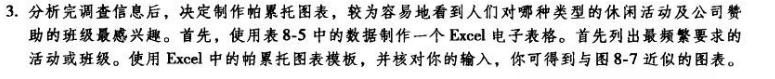
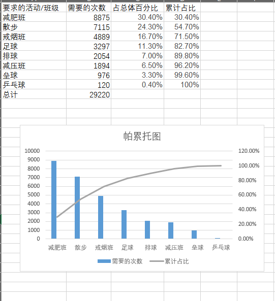

# Homework7

### RUNNING CASE

- 系统推出的两个星期内90%的员工都能登陆到系统中
- 系统推出三个月内80%的员工都完成了该系统的培训
- 系统推出两个月内30%的员工都使用此系统降低了医疗保健的费用
- 系统推出两个月内80的员工都认为此系统方便快捷。
- 建立Benchmark基准

- 通过跟踪用户的登录数量、使用系统评论，进行数据生成报告客户看出用户的系统行为，跟踪需求。

