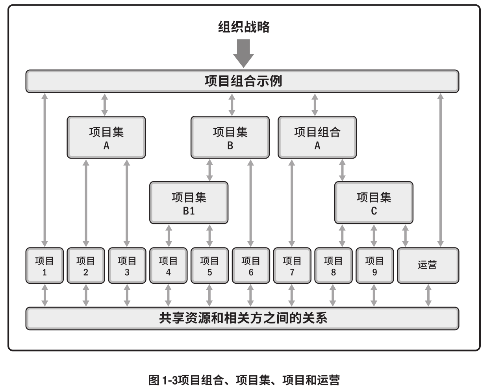
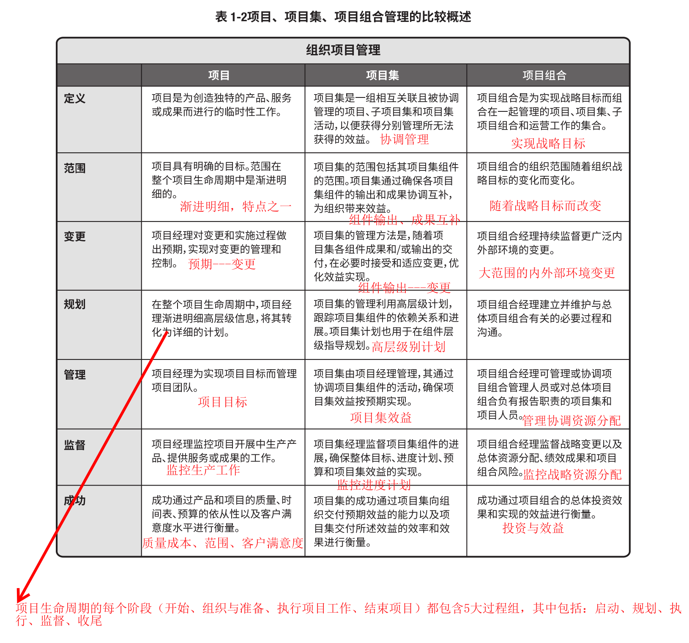
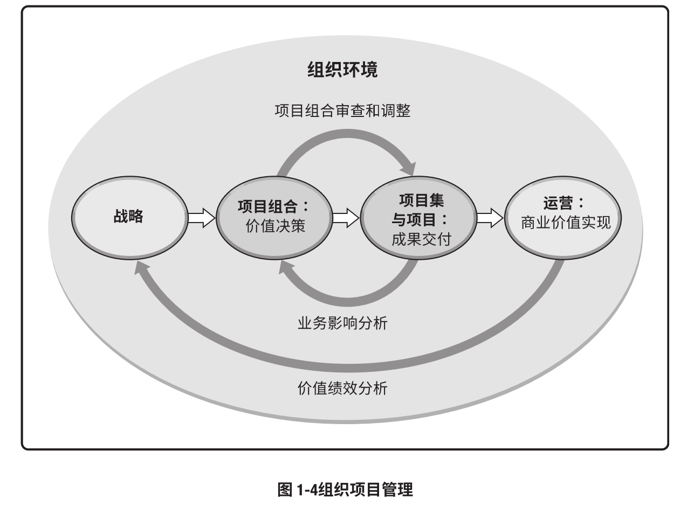

# 讨论 projects、programs、和 portfolio 之间的关系以及对企业成功的贡献；以及与operations以及OPM之间的关系。

## 1. projects、programs、和 portfolio 之间的关系

### 定义

1. projects（项目）：项目是位创造独特的产品、服务、或成果而进行的临时性工作。
2. programs（项目集）：项目及是一组互相关联且被协调管理的项目、子项目集和项目活动，以便获得分别管理所无法获得的效益。
3. portfolio（项目组合）：项目组合是为了实现战略目标而组合在一起的项目、项目集、子项目组合和运营工作的集合。

用直观的例子来说，设计卫星就是一个项目；建立卫星通讯系统就是项目集，里面包括了卫星建造、火箭发射、系统设计等项目；提升通讯基础建设就是一个项目组合，里面包含了卫星通信、光纤通信等项目集。

### 关系与区别

#### 关系

#### 区别比较

### 对企业贡献

项目创造了价值、驱动了变更；项目集通过找出项目集之间的关系，确定管理项目的最佳方法；项目组合通过顺序调配、财力、人力、物力分配等，使实现价值的最大化。

# 2. operations以及OPM之间的关系

### 定义

1. operastions（运营管理）：运营管理关注产品的持续生产和（或）服务的持续运作。它使用最优资源满足客户要求，来保证 业务运作的持续高效。它重点管理那些把各种输入（如材料、零件、能源和劳力）转变为输出（如 产品、商品和（或）服务）的过程。例如对软件的定期更新支持、客服、收集反馈等就是运营管理的一部分。
2. OPM（组织级项目管理）：OPM 旨在确保组织开展正确的项目并合适地分配关键资源。OPM 有助于确保组织的各个层级都了 解组织的战略愿景、支持愿景的举措、目标以及可交付成果。例如公司对各个项目的人事调配、资源分配、绩效考核就是OPM的一部分；

### 关系

运营管理是OPM中的一环，是在项目的商业价值实现上采取的运营管理，其运营的结果会反馈给OPM，并通过价值绩效分析影响战略调配。

