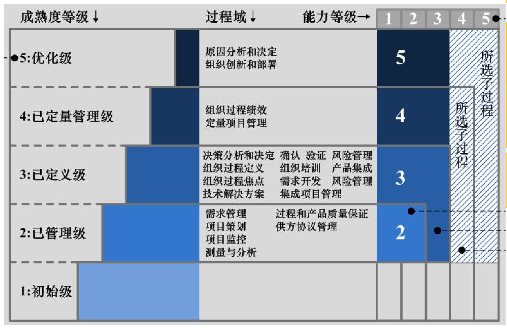
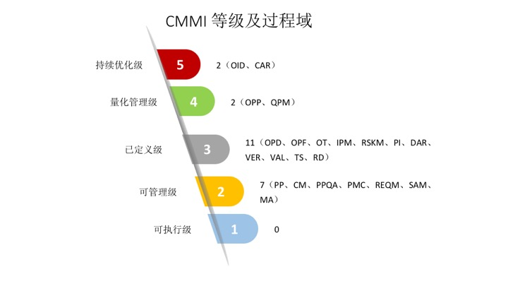

# 简述CMMI的原理和其解决行业问题的方法

CMMI即Capability Maturity Model Integration，能力成熟度模型。是世界公认的软件产品进入国际市场的通行证，不仅是对产品质量的认证，更是一种软件过程改善的途径。如果一家公司最终通过CMMI的评估认证，标志着该公司在质量管理的能力已经上升到一个新的高度。

### CMMI的5个等级

CMMI模型中将所有软件组织的软件能力成熟度划分为5个等级，分布为初始级、已管理级、已定义级、已定量管理级、优化级。

等级评测的标准就是根据过程域来评估，若企业达到了某一级别的过程域，则可评当前等级。2级有7个PA，3级有11个PA，4级有2个PA，5级有2个PA。过程域包括：

1. OPD：（Organizational Process Definition）组织级过程定义。建立和维护有用的组织过程资产。

2. OPF：（Organizational Process Focus）组织级过程焦点。在理解现有过程强项和弱项的基础上计划和实施组织过程改善。
3. OT：（Organizational Training）组织培训管理。增加组织各级人员的技能和知识，使他们能有效地执行他们的任务。
4. PP：（Project Plan）项目计划。保证在正确的时间有正确的资源可用。为每个人员分配任务。协调人员。根据实际情况，调整项目。
5. PMC：（Project Monitoring and Control）项目监督与控制。通过项目的跟踪与监控活动，及时反映项目的进度、费用、风险、规模、关键计算机资源及工作量等情况，通过对跟踪结果的分析，依据跟踪与监控策略采取有效的行动，使项目组能在既定的时间、费用、质量要求等情况下完成项目。
6. SAM：（Supplier Agreement Management）供应商协议管理。旨在对以正式协定的形式从项目之外的供方采办的产品和服务实施管理。
7. IPM：（Integrated Project Management）集成项目管理。根据从组织标准过程剪裁而来的集成的、定义的过程对项目和利益相关者的介入进行管理。
8.  RSKM：（Risk Management）风险管理。识别潜在的问题，以便策划应对风险的活动和必要时在整个项目生存周期中实施这些活动，缓解不利的影响，实现目标。
9. RD：（Requirement Development）需求开发。需求开发的目的在于定义系统的边界和功能、非功能需求，以便涉众(客户、最终用户)和项目组对所开发的内容达成一致。
10. REQM（Requirement Management）需求管理。需求管理的目的是在客户和软件项目之间就需要满足的需求建立和 维护一致的约定。
11. TS：（Technical Solution）技术解决方案。在开发。设计和实现满足需求的解决方案。解决方案的设计和实现等都围绕产品、产品组件和与过程有关的产品。
12. PI：（Product Integration）产品集成。从产品部件组装产品，确保集成产品功能正确并交付产品。
13. VAL：（Validation）验证。确认证明产品或产品部件在实际应用下满足应用要求。
14. VER：（Verification）确认。验证确保选定的工作产品满足需求规格。
15. CM：（Configuration Management）配置管理。建立和维护在项目的整个软件生存周期中软件项目产品的完整性 。
16. PPQA：（Process and Product Quality Assurance）过程和产品质量保证。为项目组和管理层提供项目过程和相关工作产品的客观信息。
17. MA：（Measurement and Analysis）测量与分析。开发和维持度量的能力，以便支持对管理信息的需要。作为改进、了解、控制决策。
18.  DAR：（Decision Analysis and Resolution）决策分析与解决。应用正式的评估过程依据指标评估候选方案，在此基础上进行决策。
19. OPP ：（Organizational Process Preformace）组织过程性能。建立与维护组织过程性能的量化标准，以便使用量化方式的管理项目。
20. QPM（Quantitative Project Management) 量化的项目管理，量化管理项目已定义的项目过程，以达成项目既定的质量和过程性能目标。
21. OID：(Organizational Innovation and Deployment）组织的创新与推展，选择并推展渐进创新的组织过程和技术改善，改善应是可度量的，所选择及推展的改善需支持基于组织业务目的的质量及过程执行目标。
22. CAR：（Causal Analysis and Resolution），识别缺失的原因并进行矫正进一步的防止未来再次发生。

评级可以参照下图

### CMMI解决行业问题的方法

CMMI模型下，虽然越高的评级代表管理更加制度规范化，但是也不一定是越高越好的，而更是要根据当前企业的实际情况来进行。CMMI的价值是帮助企业对开发流程进行标准化和规范化、控制成本、改善流程，是为了企业的商业目标——赚钱服务的。因此，CMMI可以说是企业用来提高生产力的一个规范工具。